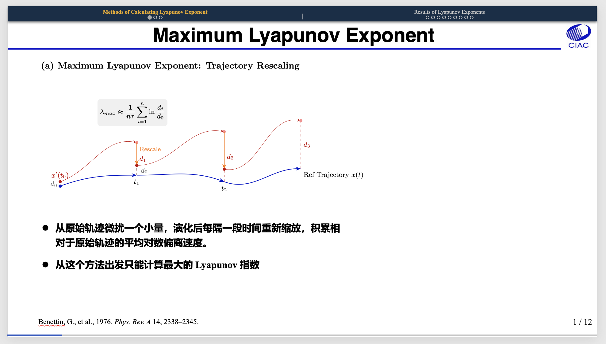

# Beamer Style MS-PPT-VBA

A collection of VBA macros for Microsoft PowerPoint, designed for researchers to create LaTeX Beamer-like navigation and automate scientific data animations.

本项目是一套专为 Microsoft PowerPoint 设计的 VBA 宏工具，旨在为研究人员提供类 LaTeX Beamer 的导航效果，并自动化处理科学数据动画。

---

## Key Features / 主要功能

### 1. Beamer-Style UI & Formatting (`BeamerStyle.vba`)

* **Dynamic Progress Bar**: Adds a real-time progress bar at the bottom of slides.
* **Header Navigation**: Generates a Beamer-style top bar based on PowerPoint "Sections," including titles and clickable slide circles.
* **Interactive Links**: All navigation elements (text and circles) are automatically hyperlinked to their respective slides.
* **Standardized Paging**: Updates page numbers to the `Current / Total` format with consistent typography.

### 1. Beamer 风格导航与格式化 (`BeamerStyle.vba`)

* **动态进度条**：在幻灯片底部添加实时进度演化条。
* **顶部导航栏**：根据 PPT 的“节 (Section)”自动生成导航栏，包含章节标题及可点击的幻灯片索引圆圈。
* **交互式跳转**：所有导航元素（文字和圆圈）均自动绑定超链接，实现快速跳转。
* **统一页码格式**：自动将页码更新为 `当前页 / 总页数` 格式，并统一字体样式。

### 2. Scientific Data Animation (`Figure_insert.vba`)

* **Automated Sequence**: Automatically reads `frame_*.png` files from a specified directory.
* **Template-Based Replacement**: Uses a placeholder named `TargetImage` in the "Selection Pane" to insert images at precise locations with consistent dimensions.

### 2. 科学数据动画导入 (`Figure_insert.vba`)

* **自动化序列生成**：自动从指定目录读取 `frame_*.png` 文件。
* **模板化替换**：利用“选择窗格”中的 `TargetImage` 标记，将图片精确插入预设位置并保持尺寸一致。

---

## 🛠 Usage / 使用步骤

### Step 1: Environment Setup / 环境准备

1. Go to **PowerPoint Preferences -> View** and check **"Show Developer tab"**.
2. Open **Developer -> Visual Basic**.
3. Insert a new **Module** and paste the content of the `.vba` files.
4. 在 PowerPoint **设置 -> 视图** 中勾选 **“显示开发工具选项卡”**。
5. 点击 **开发工具 -> Visual Basic** 打开编辑器。
6. 插入新 **模块 (Module)** 并粘贴对应的 `.vba` 文件内容。

### Step 2: Import Animation Frames / 导入动画帧

1. **Prepare Template**: Insert a placeholder image on the first slide.
2. **Name Placeholder**: Open **Home -> Arrange -> Selection Pane** and rename the image to `TargetImage`.
3. **Set Path**: Update the `folderPath` variable in `Figure_insert.vba` to your local image directory (e.g., `/Users/name/Downloads/intersection/`).
4. Run the `GenerateFramesForMac_Final` macro.
5. **准备模板**：在第一张幻灯片插入一张占位图片。
6. **命名占位符**：打开 **开始 -> 排列 -> 选择窗格**，将该图片重命名为 `TargetImage`。
7. **配置路径**：在 `Figure_insert.vba` 中修改 `folderPath` 为你的图片绝对路径。
8. 运行 `GenerateFramesForMac_Final` 宏。

### Step 3: Apply UI Formatting / 应用美化格式

* **Logic Note on Section Skipping**: To maintain a professional layout, the script is designed to skip the **first two sections** (typically the Title slide and Table of Contents) and the **last section** (typically the Acknowledgment or Q&A slide). The navigation bar and progress bar will only be generated for the main body of the presentation.
* **关于跳过章节的逻辑说明**：为保持汇报界面的专业性，脚本会自动跳过 **前两个节**（通常为标题页和目录页）以及 **最后一个节**（通常为致谢或问答环节）。导航栏与进度条仅会在演示文稿的正文章节中生成。

1. Ensure your PPT is organized into **Sections**.
2. Run the `RunAllFunctions` macro.
3. The script will scan sections and generate the header, progress bar, and page numbers.
4. 确保您的 PPT 已经按照内容划分了 **“节 (Section)”**。
5. 运行 `RunAllFunctions` 主宏。
6. 脚本将自动生成顶部导航栏、底部进度条及标准页码。

<!-- 致谢项目：BUAA PPT https://github.com/ZhouKanglei/BUAA-PPT -->
---
## Acknowledgements / 致谢
This project is inspired by the [**BUAA PPT**](https://github.com/ZhouKanglei/BUAA-PPT) project by [Zhou Kanglei](https://github.com/ZhouKanglei).

本项目的灵感来源于 [**BUAA PPT**](https://github.com/ZhouKanglei/BUAA-PPT) 项目，由 [Zhou Kanglei](https://github.com/ZhouKanglei) 开发。